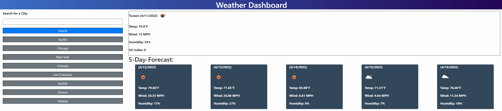

# weather_dashboard
The Weather_Dashboard is a dashboard to showcase a US cities current weather and forecasted weather. Weather information includes the Date, Temperature (in fahrenheit), Wind Speed (in miles), Humidity (in percentage), and UV Index.

## How To Use
You can search any US city in the search bar or you can use one of the preset city buttons. Upon clicking the button it will pull up the weather information for that city.

## Contributing
HTML, CSS, and JavaScript were made by Jeff Hicks. API used was courtesy of Open Weather Map. Jquery and Bootsrap used.  
